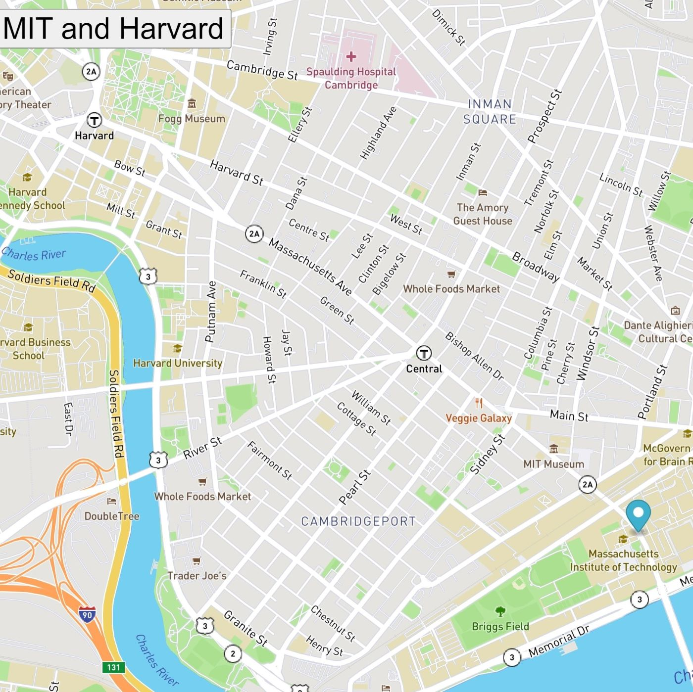

# Real time bus tracker

## Description
Showing bus stops between MIT and Harvard. The marker moves every 10 seconds. This project forcused on using async/await functions to fetch data from APIs, manipulating the DOM, and using recursive functions in order to update the location of multiple map markers every 10 seconds based on real-time coordinates. Used Mapbox and Boston MTA.

## How to run
Clone all files in this repo to your local drive. Open the index.html file in a browser. Click the "Show stops between MIT and Harvard" button.

## Roadmap of future improvements
-add marker on every bus stops

-adding styles on the maps and markers

## Licence
Copyright 2020 John Williams

Permission is hereby granted, free of charge, to any person obtaining a copy of this software and associated documentation files (the "Software"), to deal in the Software without restriction, including without limitation the rights to use, copy, modify, merge, publish, distribute, sublicense, and/or sell copies of the Software, and to permit persons to whom the Software is furnished to do so, subject to the following conditions:

The above copyright notice and this permission notice shall be included in all copies or substantial portions of the Software.

THE SOFTWARE IS PROVIDED "AS IS", WITHOUT WARRANTY OF ANY KIND, EXPRESS OR IMPLIED, INCLUDING BUT NOT LIMITED TO THE WARRANTIES OF MERCHANTABILITY, FITNESS FOR A PARTICULAR PURPOSE AND NONINFRINGEMENT. IN NO EVENT SHALL THE AUTHORS OR COPYRIGHT HOLDERS BE LIABLE FOR ANY CLAIM, DAMAGES OR OTHER LIABILITY, WHETHER IN AN ACTION OF CONTRACT, TORT OR OTHERWISE, ARISING FROM, OUT OF OR IN CONNECTION WITH THE SOFTWARE OR THE USE OR OTHER DEALINGS IN THE SOFTWARE.
